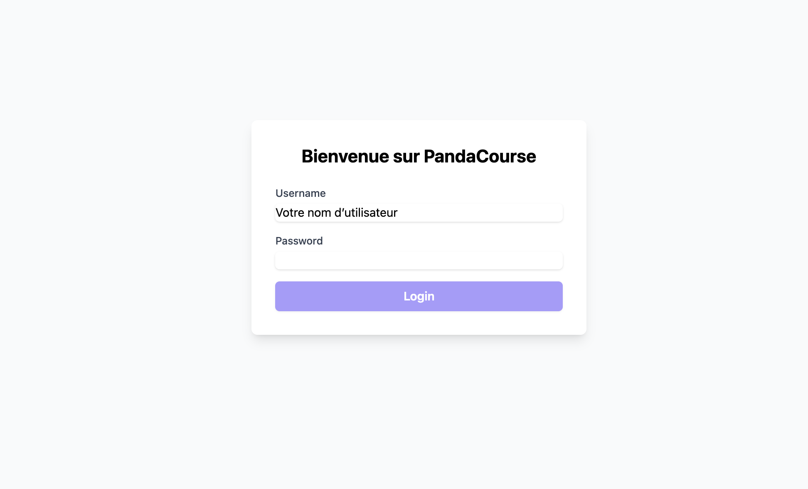
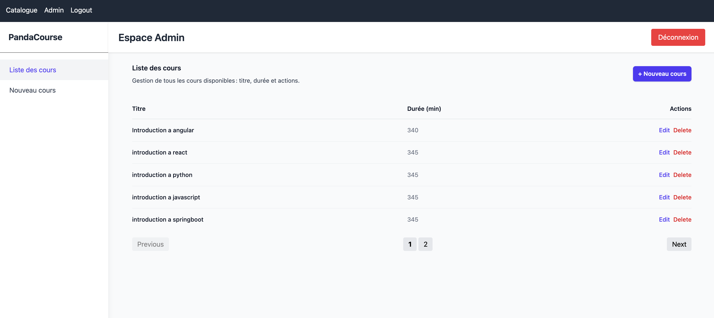
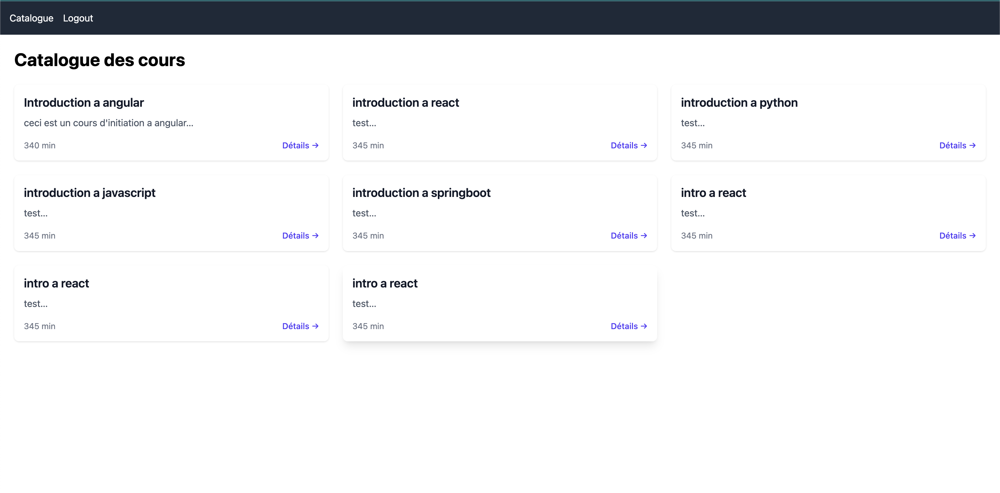

# PandaCourse

Un mini‑LMS Angular avec mock API (json‑server), tests unitaires et E2E, CI/CD et déploiement.

---
## 📸 Aperçu de l’application








 # PandaCourse

+## ✨ Fonctionnalités
+
+- Catalogue dynamique de cours (CRUD)
+- Mock API via json‑server
+- Authentification / autorisation (roles Admin & Student)
+- Lecture vidéo intégrée (player Angular)
+- Filtre & recherche de cours
+- Tests unitaires (Karma/Jasmine) et couverture
+- Tests E2E (Cypress) pour scénarios Admin & Client
+- CI/CD automatique (GitHub Actions)
+- Déploiement front sur Netlify/Vercel
+

## 📋 Prérequis

* Node.js ≥ 18.x
* npm ≥ 8.x
* Angular CLI (optionnel) :

  ```bash
  npm install -g @angular/cli@19
  ```

---

## 🚀 Installation

1. **Cloner le dépôt**

   ```bash
   git clone https://github.com/<votre‑org>/pandacourse.git
   cd pandacourse
   ```

2. **Installer les dépendances**

   ```bash
   npm install
   ```

---

## 🔧 Mock API

On utilise **json‑server** pour simuler le back :

1. Installer (si besoin)

   ```bash
   npm install -g json-server
   ```
2. Lancer le mock sur le port 3000

   ```bash
   npx json-server --watch db.json --port 3000
   ```
3. Endpoints disponibles :

   * `GET    /courses`
   * `GET    /courses/:id`
   * `POST   /courses`
   * `PUT    /courses/:id`
   * `DELETE /courses/:id`

---

## 🖥️ Lancement du front

```bash
npm start
# ou
ng serve
```

Ouvrez ensuite votre navigateur à :

```
http://localhost:4200/
```

Le rechargement est automatique à chaque modification de code.

---

## 🔨 Code scaffolding

Pour générer un composant, un service, etc. :

```bash
generate component my-new-component
generate service core/api/api
generate guard auth/auth
```

Pour voir toutes les options :

```bash
ng generate --help
```

---

## 📦 Build

* **Build de développement** (source maps, sans optimisation)

  ```bash
  ng build --configuration=development
  ```
* **Build de production** (optimisé, minifié)

  ```bash
  npm run build
  # ou
  ng build --configuration=production
  ```

> Les fichiers sont générés dans `dist/pandacourse`.

---

## ✅ Lint & Format

* **Lint** (ESLint)

  ```bash
  npm run lint
  ```
* **Format** (Prettier)

  ```bash
  npm run format
  ```

---

## 🧪 Tests

### Tests unitaires (Karma + Jasmine)

```bash
npm test
# ou
ng test
```

Pour générer le rapport de couverture :

```bash
npm run test:coverage
```

### Tests E2E (Cypress)

1. Lancer le mock API (voir plus haut)
2. Ouvrir l’interface interactive :

   ```bash
   npx cypress open
   ```
3. Ou lancer en mode headless :

   ```bash
   npx cypress run
   ```

> Les specs couvrent les scénarios **Admin** et **Client** (connexion, création/édition/suppression de cours, navigation catalogue, player…).

---

## 🔗 CI / CD

Un pipeline GitHub Actions est configuré dans `.github/workflows/ci.yml` :

1. **lint**
2. **test\:unit** (Karma)
3. **test\:e2e** (Cypress)
4. **build**
5. (optionnel) **deploy** sur Netlify / Vercel

```yaml
# .github/workflows/ci.yml
name: CI

on: [push]

jobs:
  lint:
    runs-on: ubuntu-latest
    steps:
      - uses: actions/checkout@v4
      - uses: actions/setup-node@v3
        with: node-version: '18'
      - run: npm ci
      - run: npm run lint

  unit:
    needs: lint
    runs-on: ubuntu-latest
    steps:
      - uses: actions/checkout@v4
      - uses: actions/setup-node@v3
        with: node-version: '18'
      - run: npm ci
      - run: npm test -- --watch=false --browsers=ChromeHeadless

  e2e:
    needs: unit
    runs-on: ubuntu-latest
    services:
      api:
        image: clue/json-server
        ports: ['3000:80']
        options: --entrypoint "json-server --watch /data/db.json --port 80"
        volumes:
          - ./:/data
    steps:
      - uses: actions/checkout@v4
      - uses: actions/setup-node@v3
        with: node-version: '18'
      - run: npm ci
      - run: npx wait-on http://localhost:3000/courses
      - run: npx cypress run

  build:
    needs: [unit, e2e]
    runs-on: ubuntu-latest
    steps:
      - uses: actions/checkout@v4
      - uses: actions/setup-node@v3
        with: node-version: '18'
      - run: npm ci
      - run: npm run build
      - uses: actions/upload-artifact@v3
        with:
          name: pandacourse-dist
          path: dist/pandacourse
```

---

## ☁️ Déploiement

### Frontend

* **Netlify** / **Vercel**

  * Connecter votre repo
  * Commande de build : `npm run build`
  * Répertoire à publier : `dist/pandacourse`

### Mock API public

* Pousser `db.json` dans un repo dédié
* Utiliser **json‑server** sur Heroku, ou un service type **mockapi.io**

---

## 📚 Ressources

* [Angular CLI Overview & Command Reference](https://angular.io/cli)
* [Karma](https://karma-runner.github.io)
* [Cypress](https://www.cypress.io)
* [json-server](https://github.com/typicode/json-server)

---

> **Bon développement !**
> PandaCourse vous simplifie la création et la consommation de cours en ligne, avec tout le workflow CI/CD déjà en place.
